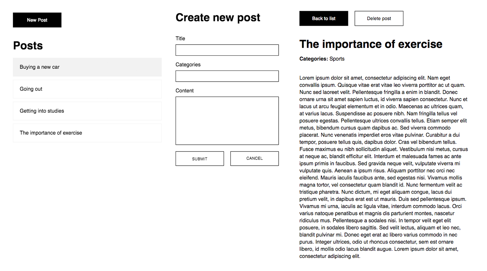

# React-Redux-Blog
Blog application created using React, Redux, React Router, Redux Promise and external reduxblog API for data storage.

You can check it out here: https://mindaras.github.io/blog-app

Warning: This examplary application uses real data storage service and anyone is able to create and delete posts. Although I'll try to look after the language and quality of the posts, there is a risk that someone might use an offensive language.

Components:

